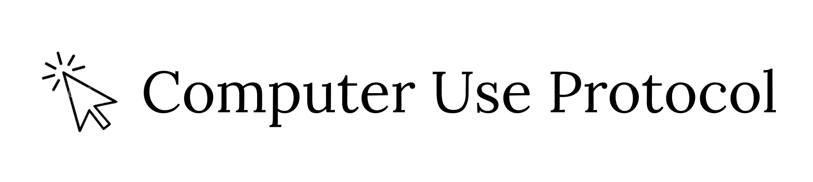

<p align="center">
  <a href="https://computeruseprotocol.com">
    
  </a>
</p>

<p align="center">
  <b>An open specification for describing desktop UIs in a universal, OS-agnostic format - built for computer use agents.</b>
</p>

<br>

<p align="center">
  <a href="https://github.com/computeruseprotocol/computer-use-protocol/blob/main/LICENSE"></a>
  <a href="https://computeruseprotocol.com"></a>
</p>

## What is Computer Use Protocol (CUP)?

CUP is **protocol first**. At its core is a universal schema for representing UI accessibility trees — one format that works identically across Windows, macOS, Linux, Web, Android, and iOS. This repository is that core: the JSON schema, the compact text format, the cross-platform role/state/action mappings, and documentation.

CUP also provides SDKs and MCP servers — but those exist to serve the protocol, not the other way around. The protocol is the foundation; everything else is built on top.

**The layering:**

| Layer | What it does | Where it lives |
|-------|-------------|----------------|
| **Protocol** (this repo) | Defines the universal tree format — roles, states, actions, schema, compact encoding | [computeruseprotocol](https://github.com/computeruseprotocol/computer-use-protocol) |
| **SDKs** | Capture native accessibility trees, normalize them into CUP format, execute actions | [python-sdk](https://github.com/computeruseprotocol/python-sdk) · [typescript-sdk](https://github.com/computeruseprotocol/typescript-sdk) |
| **MCP servers** | Expose CUP snapshots and actions as tools for AI agents (Claude, Copilot, etc.) | Bundled with each SDK |

The protocol says "here's how to describe a button." An SDK says "here's how to find it on screen and click it." An MCP server says "here's how an AI agent can request that." Each layer builds on the one below it, but only the protocol is required — everything else is optional.

## The problem

Every platform exposes UI accessibility differently:

| Platform | API | Roles | IPC |
|----------|-----|-------|-----|
| Windows | UIA (COM) | ~40 ControlTypes | COM |
| macOS | AXUIElement | AXRole + AXSubrole | XPC / Mach |
| Linux | AT-SPI2 | ~100+ AtspiRole values | D-Bus |
| Web | ARIA | ~80 ARIA roles | In-process / CDP |
| Android | AccessibilityNodeInfo | Java class names | Binder |
| iOS | UIAccessibility | ~15 trait flags | In-process |

AI agents like Claude Computer Use, OpenAI CUA, and Microsoft UFO2 each independently reinvent UI perception. CUP solves this at the representation layer — one schema, one vocabulary, one format — so that implementations don't have to.

## Schema

CUP defines a JSON envelope format built on ARIA-derived roles:

```json
{
    "version": "0.1.0",
    "platform": "windows",
    "timestamp": 1740067200000,
    "screen": { "w": 2560, "h": 1440, "scale": 1.0 },
    "app": { "name": "Discord", "pid": 1234 },
    "tree": [
        {
            "id": "e0",
            "role": "window",
            "name": "Discord",
            "bounds": { "x": 509, "y": 62, "w": 1992, "h": 1274 },
            "states": ["focused"],
            "actions": ["click"],
            "children": [ ... ]
        }
    ]
}
```

Key design decisions:
- **59 ARIA-derived roles** — the universal subset that maps cleanly across all 6 platforms
- **16 state flags** — only truthy/active states are listed (absence = default)
- **15 action verbs** — a canonical vocabulary for what can be done with an element (the protocol defines the names; SDKs provide execution)
- **Platform escape hatch** — raw native properties preserved in `node.platform.*` for advanced use

Full schema: [schema/cup.schema.json](schema/cup.schema.json) | Compact format spec: [schema/compact.md](schema/compact.md) | Role mappings: [schema/mappings.json](schema/mappings.json)

## Roles

59 ARIA-derived roles:

`alert` `alertdialog` `application` `banner` `button` `cell` `checkbox` `columnheader` `combobox` `complementary` `contentinfo` `dialog` `document` `form` `generic` `grid` `group` `heading` `img` `link` `list` `listitem` `log` `main` `marquee` `menu` `menubar` `menuitem` `menuitemcheckbox` `menuitemradio` `navigation` `none` `option` `progressbar` `radio` `region` `row` `rowheader` `scrollbar` `search` `searchbox` `separator` `slider` `spinbutton` `status` `switch` `tab` `table` `tablist` `tabpanel` `text` `textbox` `timer` `titlebar` `toolbar` `tooltip` `tree` `treeitem` `window`

## States

16 state flags (only truthy/active states are listed — absence = default):

`busy` `checked` `collapsed` `disabled` `editable` `expanded` `focused` `hidden` `mixed` `modal` `multiselectable` `offscreen` `pressed` `readonly` `required` `selected`

## Actions

The protocol defines 15 canonical action verbs — the vocabulary for what an agent can do with an element. The protocol specifies the names and semantics; SDKs provide the actual execution against native platform APIs.

| Action | Parameters | Description |
|--------|-----------|-------------|
| `click` | — | Click/invoke the element |
| `collapse` | — | Collapse an expanded element |
| `decrement` | — | Decrement a slider/spinbutton |
| `dismiss` | — | Dismiss a dialog/popup |
| `doubleclick` | — | Double-click |
| `expand` | — | Expand a collapsed element |
| `focus` | — | Move keyboard focus to the element |
| `increment` | — | Increment a slider/spinbutton |
| `longpress` | — | Long-press (touch/mobile interaction) |
| `rightclick` | — | Right-click (context menu) |
| `scroll` | `direction: str` | Scroll container (up/down/left/right) |
| `select` | — | Select an item in a list/tree/tab |
| `setvalue` | `value: str` | Set element value programmatically |
| `toggle` | — | Toggle checkbox or switch |
| `type` | `value: str` | Type text into a field |

Session-level actions (not element-scoped):

| Action | Parameters | Description |
|--------|-----------|-------------|
| `press_keys` | `keys: str` | Send a keyboard shortcut |
| `wait` | `ms: int` | Wait/delay between actions in a batch |

## Compact format

A token-efficient text representation optimized for LLM context windows (~75% smaller than JSON):

```
# CUP 0.1.0 | windows | 2560x1440
# app: Discord
# 87 nodes (353 before pruning)

[e0] window "Discord" @509,62 1992x1274
    [e1] document "General | Lechownia" @509,62 1992x1274 {readonly}
        [e2] button "Back" @518,66 26x24 [click]
        [e3] button "Forward" @546,66 26x24 {disabled} [click]
        [e7] tree "Servers" @509,94 72x1242
            [e8] treeitem "Lechownia" @513,190 64x48 {selected} [click,select]
```

Line format: `[id] role "name" @x,y wxh {states} [actions] val="value" (attrs)`

Full spec: [schema/compact.md](schema/compact.md)

## SDKs

SDKs implement the protocol — they capture native accessibility trees, normalize them into CUP format, execute actions, and optionally expose everything through MCP servers for AI agent integration.

| Language | Repository | Package |
|----------|-----------|---------|
| Python | [python-sdk](https://github.com/computeruseprotocol/python-sdk) | `pip install computeruseprotocol` |
| TypeScript | [typescript-sdk](https://github.com/computeruseprotocol/typescript-sdk) | `npm install computeruseprotocol` |

Building your own SDK? All you need is this spec. Implement tree capture for your target platform, normalize into the CUP schema, and you're compatible with every tool in the ecosystem.

## Documentation

- **[JSON Schema](schema/cup.schema.json)** — Full envelope schema
- **[Compact Format Spec](schema/compact.md)** — LLM-optimized text format
- **[Role Mappings](schema/mappings.json)** — 59 roles mapped across 6 platforms
- **[Example Envelope](schema/example.json)** — Sample CUP output

## Contributing

CUP is in early development (v0.1.0). Contributions to the specification are welcome — especially:

- New role or action proposals with cross-platform mapping rationale
- Platform mapping improvements in [schema/mappings.json](schema/mappings.json)
- Schema documentation and examples

For SDK contributions (bug fixes, new platform adapters, etc.), see the language-specific repos above.

See [CONTRIBUTING.md](CONTRIBUTING.md) for guidelines.

## License

[MIT](LICENSE)
